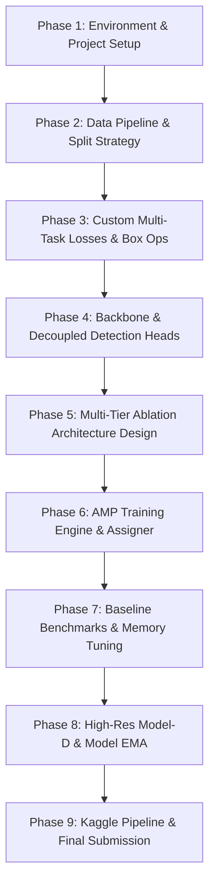

# 🛰️ Vanilla Drone Detection — Development & Research Plan

  
  
  
  

---

## 👨‍💻 Project Overview

This repository hosts the from-scratch prototype and experimental framework for the **ISLab Pusan National University AI Engineering Researcher Position Evaluation**.

The objective is to design, implement, and benchmark a **100% Vanilla Anchor-Free Object Detector** for drone detection and classification under severe scale disparity (tiny distant objects) and complex aerial background clutter, without relying on any pretrained weights or third-party detection frameworks (e.g., MMDetection, Detectron2, Ultralytics).

---

## 🎯 Core Requirements & Constraints

- 🚫 **No Pretrained Weights**: Entire network initialized randomly from scratch ($\mathcal{N}(0, \sigma^2)$).
- 📐 **Custom Loss Function**: Hand-crafted multi-task objective addressing extreme aerial scale disparity and class imbalance.
- 🔬 **Systematic Ablation Study**: Multi-tier architectural evolution isolating feature fusion, spatial attention, and stride mechanics.
- 📄 **IEEE Conference Paper**: 3–4 page manuscript documenting methodology, mathematical formulations, and comparative findings.
- 🐳 **Clean Code & Containerization**: OOP design with clean modular separation and Docker orchestration.

---

## 🗺️ Planned Development Roadmap

### 1. Data Pipeline & Temporal Leakage Prevention
- **`DroneYOLODataset`**: Pure PyTorch dataset loader with high-speed in-memory pre-resized caching for maximum GPU throughput.
- **Leakage-Free Splitting**: Sequence-aware regex grouping (`scripts/prepare_splits.py`) ensuring frames from the same video sequence are never split across train and validation sets.
- **Augmentation Suite**: Multi-scale training, photometric color jitter, and random horizontal flipping.

### 2. Custom Multi-Task Objective ($\mathcal{L}_{\text{hybrid}}$)
- **Focal Loss ($\mathcal{L}_{\text{cls}}$)**: Suppresses overwhelming background easy negatives ($>99.8\%$ of spatial cells).
- **Normalized Wasserstein Distance ($\mathcal{L}_{\text{NWD}}$)**: Models boxes as 2D Gaussian distributions for smooth geometric gradients on tiny sub-20px drones.
- **Complete IoU ($\mathcal{L}_{\text{CIoU}}$)**: Enforces scale-invariant overlap, Euclidean center distance, and aspect ratio alignment.
- **Centerness / Objectness Quality Loss ($\mathcal{L}_{\text{obj}}$)**: Mitigates low-quality boundary false positives.

$$\mathcal{L}_{\text{total}} = \lambda_{\text{cls}} \mathcal{L}_{\text{cls}} + \lambda_{\text{obj}} \mathcal{L}_{\text{obj}} + \lambda_{\text{reg}} \left( \alpha \mathcal{L}_{\text{CIoU}} + (1 - \alpha) \mathcal{L}_{\text{NWD}} \right)$$

### 3. Progressive Architectural Ablation Suite
To provide empirical attribution for every design component, four models will be developed and benchmarked:

| Model | Neck Architecture | Attention Mechanism | Feature Strides | Focus Area |
| :--- | :--- | :--- | :--- | :--- |
| **Model-A** (`model_a_fpn`) | Top-Down FPN | None | $[8, 16, 32]$ | Baseline top-down semantic pyramid |
| **Model-B** (`model_b_pan`) | Bidirectional FPN + PAN | None | $[8, 16, 32]$ | Bottom-up spatial localization cues |
| **Model-C** (`model_c_attn`) | Bidirectional FPN + PAN | CBAM (Channel + Spatial) | $[8, 16, 32]$ | Saliency focus & aerial clutter suppression |
| **Model-D** (`model_d_p2_ema`) | 4-Level High-Res FPNPAN4 | CBAM + Model EMA | $[4, 8, 16, 32]$ | High-resolution P2 stride-4 for sub-20px drones |

### 4. Training Engine & Cloud Benchmarking
- Mixed-precision (`torch.cuda.amp`) training loop with gradient clipping and cosine annealing learning rate scheduler.
- Scale-aware `TargetAssigner` with center radius sampling.
- Standardized evaluation measuring COCO-style $\text{mAP}@50$, $\text{mAP}@50:95$, Precision, Recall, inference latency (ms), and FPS throughput.
- Comparative baseline benchmarks against standard reference models: **YOLOv8-nano (3.2M)**, **YOLOv8-small (11.2M)**, and **RT-DETR-L (32.0M)**.

---

## 🛠️ Tech Stack & Tools

<table>
  <tr>
    <td><strong>Core Framework</strong></td>
    <td>
       
      PyTorch 2.2+ · Torchvision · PyYAML
    </td>
  </tr>
  <tr>
    <td><strong>Computer Vision</strong></td>
    <td>
       
      OpenCV · PIL · NumPy · Matplotlib
    </td>
  </tr>
  <tr>
    <td><strong>MLOps & Cloud</strong></td>
    <td>
       
      Docker · Docker Compose · Kaggle GPU (T4/P100) · Weights & Biases
    </td>
  </tr>
  <tr>
    <td><strong>Documentation</strong></td>
    <td>
       
      IEEE Conference LaTeX Template · Overleaf
    </td>
  </tr>
</table>

---

## 👤 Author & Contact

**Fajar Wira Adikusuma**  
*Data Scientist / AI Engineer*  

  
  
  

