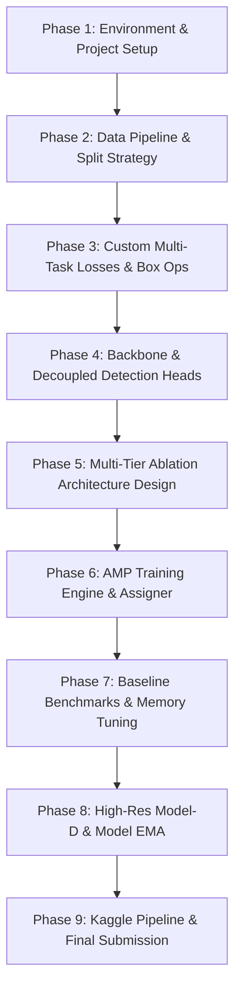

# 🛰️ Vanilla Drone Detection — Development & Project Plan

<p align="center">
  
  
  
  
</p>

---

## 👨‍💻 Project Overview

This repository hosts the from-scratch prototype and experimental framework for the **ISLab Pusan National University AI Engineering Researcher Position Evaluation**.

The central contribution of this project is the formulation of a **Hybrid Multi-Task Loss Objective ($\mathcal{L}_{\text{hybrid}}$)** designed to overcome the severe limitations of standard IoU-based regression when detecting ultra-small, distant UAV drones ($<20\times20\text{ px}$). By combining **Normalized Gaussian Wasserstein Distance (NWD)** for scale-insensitive tiny target regression, **Complete IoU (CIoU)** for aspect-ratio preservation on medium targets, and **Sigmoid Focal Loss** for background class imbalance, our 100% vanilla anchor-free detector achieves stable gradient propagation without relying on pretrained backbones or transfer learning.

---

## 🎯 Core Project Focus & Constraints

- 📐 **Novel Custom Multi-Task Objective (Core Contribution)**: Formulated from scratch to eliminate gradient vanishing on microscopic bounding box overlaps.
- 🚫 **100% Vanilla Training**: All model weights initialized strictly from scratch ($\mathcal{N}(0, \sigma^2)$) without external pretrained feature extractors.
- 📊 **Leakage-Free Sequence Splitting**: Stratified 80/20 video sequence partitioning preventing temporal overlap between training and validation.
- 🔬 **Systematic Ablation Benchmark**: 4-tier architectural progression isolating feature fusion, spatial attention, and stride mechanics.
- 📄 **IEEE Conference Paper**: 3–4 page LaTeX manuscript presenting mathematical derivations and comparative findings.

---

## 🗺️ Planned Development Roadmap



### 1. Data Pipeline & Temporal Leakage Prevention
- **`DroneYOLODataset`**: Pure PyTorch dataset loader with high-speed in-memory pre-resized caching for maximum GPU throughput.
- **Leakage-Free Splitting**: Sequence-aware regex grouping (`scripts/prepare_splits.py`) ensuring frames from the same video sequence are never split across train and validation sets.
- **Augmentation Suite**: Multi-scale training, photometric color jitter, and random horizontal flipping.

### 2. Custom Multi-Task Objective ($\mathcal{L}_{\text{hybrid}}$) — Core Contribution
Traditional IoU regression metrics exhibit severe gradient degradation when applied to tiny objects ($<20\times20\text{ px}$): a minor 2-pixel spatial deviation causes IoU to plummet drastically, and non-overlapping boxes yield zero gradient ($\nabla \text{IoU} = 0$). To resolve this, our multi-task objective combines:

- **Normalized Wasserstein Distance ($\mathcal{L}_{\text{NWD}}$)**: Models bounding boxes $B = (cx, cy, w, h)$ as 2D Gaussian distributions $\mathcal{N}(\boldsymbol{\mu}, \mathbf{\Sigma})$ with $\boldsymbol{\mu}=(cx, cy)$ and $\mathbf{\Sigma}=\text{diag}(w^2/4, h^2/4)$. By computing the optimal transport Wasserstein distance $W_2^2(\mathcal{N}_p, \mathcal{N}_g)$, NWD provides continuous, non-zero gradients even with zero spatial overlap:
  $$\text{NWD}(\mathcal{N}_p, \mathcal{N}_g) = \exp\left(-\frac{\sqrt{W_2^2(\mathcal{N}_p, \mathcal{N}_g)}}{C}\right), \quad \mathcal{L}_{\text{NWD}} = 1 - \text{NWD}$$
- **Complete IoU ($\mathcal{L}_{\text{CIoU}}$)**: Enforces scale-invariant bounding box overlap, center Euclidean distance, and aspect ratio alignment for medium/large drones:
  $$\mathcal{L}_{\text{CIoU}} = 1 - \text{IoU} + \frac{\rho^2(b, b^{gt})}{c^2} + \alpha v$$
- **Sigmoid Focal Loss ($\mathcal{L}_{\text{cls}}$)**: Suppresses overwhelming background easy negatives ($>99.8\%$ of spatial grid cells):
  $$\mathcal{L}_{\text{cls}} = -\alpha_t (1 - p_t)^\gamma \log(p_t)$$
- **Centerness Quality Loss ($\mathcal{L}_{\text{obj}}$)**: Binary cross-entropy penalizing low-quality detections far from target centers.

$$\mathcal{L}_{\text{total}} = \lambda_{\text{cls}} \mathcal{L}_{\text{cls}} + \lambda_{\text{obj}} \mathcal{L}_{\text{obj}} + \lambda_{\text{reg}} \left( \alpha \mathcal{L}_{\text{CIoU}} + (1 - \alpha) \mathcal{L}_{\text{NWD}} \right)$$

### 3. Progressive Architectural Ablation Suite
To provide empirical attribution for every design component, four models will be developed and benchmarked:

| Model | Neck Architecture | Attention Mechanism | Feature Strides | Focus Area |
| :--- | :--- | :--- | :--- | :--- |
| **Model-A** (`model_a_fpn`) | Top-Down FPN | None | $[8, 16, 32]$ | Baseline top-down semantic pyramid |
| **Model-B** (`model_b_pan`) | Bidirectional FPN + PAN | None | $[8, 16, 32]$ | Bottom-up spatial localization cues |
| **Model-C** (`model_c_attn`) | Bidirectional FPN + PAN | CBAM (Channel + Spatial) | $[8, 16, 32]$ | Saliency focus & aerial clutter suppression |
| **Model-D** (`model_d_p2_ema`) | 4-Level High-Res FPNPAN4 | CBAM + Model EMA | $[4, 8, 16, 32]$ | High-resolution P2 stride-4 for sub-20px drones |

### 4. Training Engine & Cloud Benchmarking
- Mixed-precision (`torch.cuda.amp`) training loop with gradient clipping and cosine annealing learning rate scheduler.
- Scale-aware `TargetAssigner` with center radius sampling.
- Standardized evaluation measuring COCO-style $\text{mAP}@50$, $\text{mAP}@50:95$, Precision, Recall, inference latency (ms), and FPS throughput.
- Comparative baseline benchmarks against standard reference models: **YOLOv8-nano (3.2M)**, **YOLOv8-small (11.2M)**, and **RT-DETR-L (32.0M)**.

---

## 🛠️ Tech Stack & Tools

<table>
  <tr>
    <td><strong>Core Framework</strong></td>
    <td>
      <br/>
      <sub>PyTorch 2.2+ · Torchvision · PyYAML</sub>
    </td>
  </tr>
  <tr>
    <td><strong>Computer Vision</strong></td>
    <td>
      <br/>
      <sub>OpenCV · PIL · NumPy · Matplotlib</sub>
    </td>
  </tr>
  <tr>
    <td><strong>MLOps & Cloud</strong></td>
    <td>
      <br/>
      <sub>Docker · Docker Compose · Kaggle GPU (T4/P100) · Weights & Biases</sub>
    </td>
  </tr>
  <tr>
    <td><strong>Documentation</strong></td>
    <td>
      <br/>
      <sub>IEEE Conference LaTeX Template · Overleaf</sub>
    </td>
  </tr>
</table>

## 📚 References & Citations

```bibtex
@article{wang2021normalized,
  title={A Normalized Gaussian Wasserstein Distance for Tiny Object Detection},
  author={Wang, Jinwang and Xu, Chang and Yang, Wen and Yu, Lei},
  journal={arXiv preprint arXiv:2110.13389},
  year={2021}
}

@inproceedings{zheng2020distance,
  title={Distance-IoU Loss: Faster and Better Learning for Bounding Box Regression},
  author={Zheng, Zhaohui and Wang, Ping and Liu, Wei and Li, Jinze and Ye, Rongguang and Ren, Dongwei},
  booktitle={Proceedings of the AAAI Conference on Artificial Intelligence},
  volume={34},
  pages={12993--13000},
  year={2020}
}

@inproceedings{lin2017focal,
  title={Focal Loss for Dense Object Detection},
  author={Lin, Tsung-Yi and Goyal, Priya and Girshick, Ross and He, Kaiming and Doll{\'a}r, Piotr},
  booktitle={Proceedings of the IEEE International Conference on Computer Vision (ICCV)},
  pages={2980--2988},
  year={2017}
}

@inproceedings{tian2019fcos,
  title={FCOS: Fully Convolutional One-Stage Object Detection},
  author={Tian, Zhi and Shen, Chunhua and Chen, Hao and He, Tong},
  booktitle={Proceedings of the IEEE/CVF International Conference on Computer Vision (ICCV)},
  pages={9627--9636},
  year={2019}
}

@inproceedings{woo2018cbam,
  title={CBAM: Convolutional Block Attention Module},
  author={Woo, Sanghyun and Park, Jongchan and Lee, Joon-Young and Kweon, In So},
  booktitle={Proceedings of the European Conference on Computer Vision (ECCV)},
  pages={3--19},
  year={2018}
}
```

---

## 👤 Author & Contact

**Fajar Wira Adikusuma**  
*Data Scientist / AI Engineer*  

<p align="left">
  <a href="https://github.com/aeoncyr"></a>
  <a href="https://www.linkedin.com/in/fajarwiraa/"></a>
  <a href="mailto:fajar.wira.a@gmail.com"></a>
</p>
