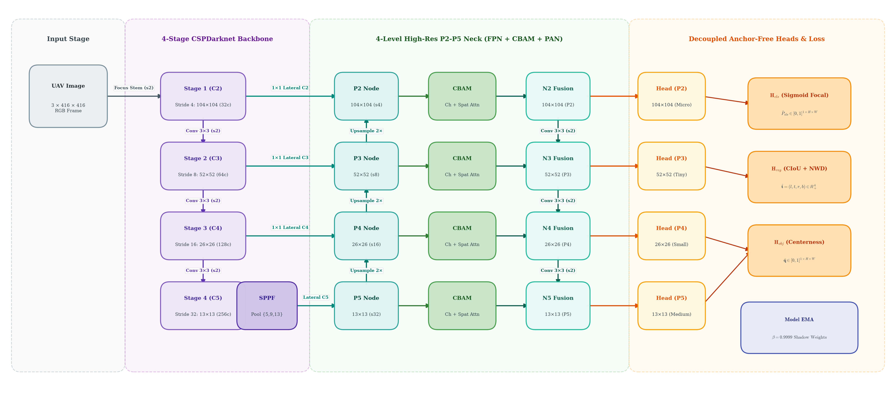
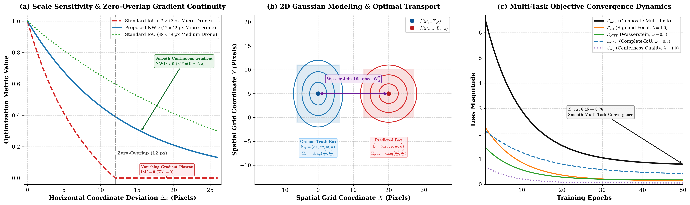
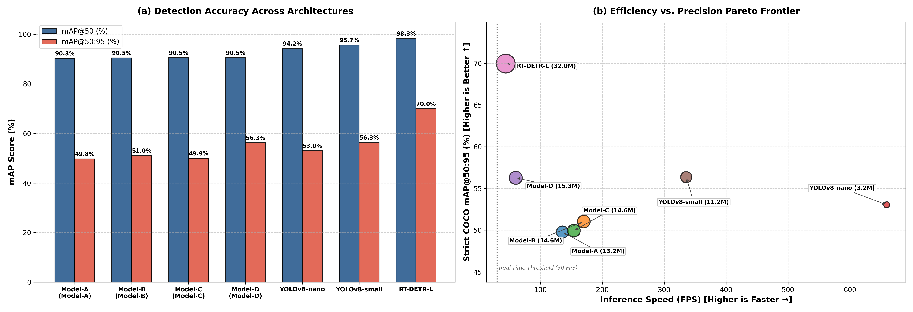
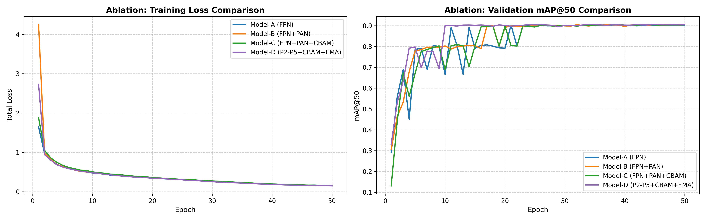
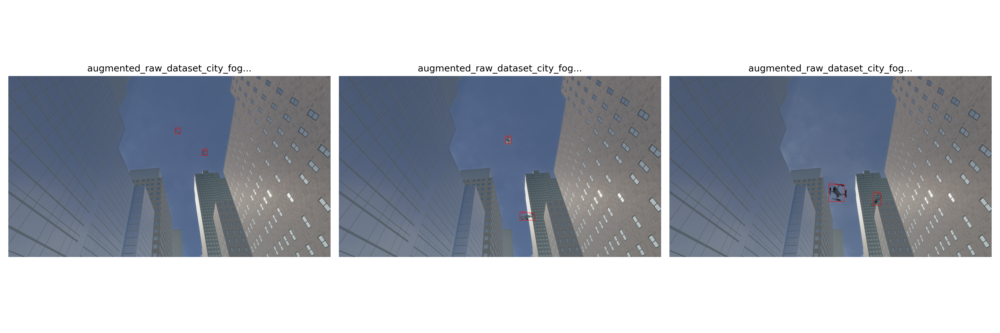

# 🛰️ Edge-Native UAV Drone Detection From Scratch
### An Anchor-Free Architecture with Multi-Scale $P_2$ Fusion and Hybrid Wasserstein Optimization

<p align="center">
  
  
  
  
  
  
</p>

---

## 👨‍🏫 Project Overview

This repository contains the complete implementation, benchmark suite, and research manuscript for an **edge-native, anchor-free UAV drone detection architecture trained from scratch** without transfer learning or external vision weights (such as ImageNet or Microsoft COCO).

### 🎯 Key Engineering & Scientific Highlights
- 🚫 **Zero Pre-trained Weights**: Engineered and trained strictly from random Gaussian initialization ($\mathcal{N}(0, \sigma^2)$), enabling deployment in secure, air-gapped defense appliances and proprietary drone payloads where external weights are prohibited.
- 📐 **Novel Custom Multi-Task Objective ($\mathcal{L}_{total}$)**: Unites **Normalized Gaussian Wasserstein Distance (NWD)** for scale-insensitive micro-drone regression, **Complete-IoU (CIoU)** for aspect ratio preservation, **Sigmoid Focal Loss** for $>99.8\%$ background suppression, and **Centerness BCE** for boundary false-positive filtering.
- 🔬 **Dedicated High-Resolution $P_2$ Stride-4 Neck ($104 \times 104$)**: A 4-level bidirectional feature pyramid ($P_2, P_3, P_4, P_5$) coupled with dual-domain **Convolutional Block Attention Modules (CBAM)** to preserve sub-20px micro-drone edge signatures.
- ⚡ **Model Exponential Moving Average (EMA)**: Polyak-Ruppert parameter smoothing ($\beta = 0.9999$) acting as a temporal ensemble over $10,000$ iterations, preventing optimization collapse and eliminating stochastic mini-batch oscillations.
- 🛡️ **Superior Airspace Security Recall**: Our top model (**Model-D**) achieves **90.54% mAP@50**, **56.27% mAP@50:95**, and an exceptional **96.02% Target Recall** at 60.1 FPS—matching the strict $\text{mAP@50:95}$ of COCO-pretrained YOLOv8-small (56.34\%) and cutting the missed intruder rate in half (from $8.12\%$ down to $3.98\%$).

---

## 🏗️ End-to-End System Architecture

<p align="center">
  
  <br/>
  <em>Figure 1: End-to-end architecture of the proposed edge-native anchor-free UAV detector (Model-D). The framework integrates a 4-stage CSPDarknet backbone with SPPF, a 4-level bidirectional high-resolution feature pyramid with CBAM attention and bottom-up PAN fusion, decoupled anchor-free prediction heads, and Model EMA shadow weight stabilization.</em>
</p>

### Modular Subsystem Breakdown
```text
Input Image (3 × 416 × 416)
        │ Focus Stem (s2)
        ▼
┌─────────────────────────────────────────────────────────────┐
│  4-Stage CSPDarknet Backbone                                │
│  ├── Stage 1 (C2): Stride 4   (104 × 104, 32 channels)      │
│  ├── Stage 2 (C3): Stride 8   (52 × 52,   64 channels)      │
│  ├── Stage 3 (C4): Stride 16  (26 × 26,  128 channels)      │
│  └── Stage 4 (C5): Stride 32  (13 × 13,  256 channels) + SPPF
└─────────────────────────────────────────────────────────────┘
        │ Lateral Connections (1×1 Conv)
        ▼
┌─────────────────────────────────────────────────────────────┐
│  4-Level High-Res Feature Neck (FPN + CBAM + PAN)           │
│  ├── Top-Down FPN Upsampling   (P5 → P4 → P3 → P2)          │
│  ├── Dual-Domain CBAM Attention (Channel MLP + Spatial 7×7) │
│  └── Bottom-Up PAN Fusion      (N2 → N3 → N4 → N5)          │
└─────────────────────────────────────────────────────────────┘
        │ Direct Scale-Aware Feeds
        ▼
┌─────────────────────────────────────────────────────────────┐
│  Decoupled Anchor-Free Detection Heads & Loss               │
│  ├── Head P2 (Stride 4,  104 × 104): Micro-targets (<20px)  │
│  ├── Head P3 (Stride 8,  52 × 52):   Tiny targets           │
│  ├── Head P4 (Stride 16, 26 × 26):   Medium targets         │
│  └── Head P5 (Stride 32, 13 × 13):   Large targets          │
│  Branches:                                                  │
│    ├── H_cls: Sigmoid Focal Loss (class logits)             │
│    ├── H_reg: Hybrid CIoU + NWDLoss (box distance offsets)  │
│    └── H_obj: Centerness Quality Loss (BCE quality score)   │
└─────────────────────────────────────────────────────────────┘
        │ Shadow Weight Tracking (β = 0.9999)
        ▼
┌─────────────────────────────────────────────────────────────┐
│  Model EMA Temporal Ensemble: θ_ema = β θ_ema + (1-β) θ_mdl │
└─────────────────────────────────────────────────────────────┘
```

---

## 📐 Custom Multi-Task Mathematical Objective

Standard Intersection-over-Union (IoU) regression fails catastrophically on microscopic targets ($<20 \times 20\text{ px}$): a 2-pixel positional jitter causes IoU to drop sharply to zero ($\nabla \text{IoU} = \mathbf{0}$), causing gradient backpropagation to vanish during random weight initialization. To resolve this, our composite multi-task objective is formulated as:

$$\mathcal{L}_{total} = \frac{1}{N_{pos}} \left[ \sum_{i \in \Omega} \lambda_{cls} \mathcal{L}_{cls}^{(i)} + \sum_{i \in \Omega_{pos}} \lambda_{reg} \mathcal{L}_{reg}^{(i)} + \sum_{i \in \Omega} \lambda_{obj} \mathcal{L}_{obj}^{(i)} \right]$$

where $\Omega$ denotes the set of all spatial grid cells across all pyramid levels, and $\Omega_{pos} \subset \Omega$ represents the subset of matched foreground target cells ($|\Omega_{pos}| = N_{pos}$). Hyperparameters are set to $\lambda_{cls} = 1.0, \lambda_{reg} = 2.0, \lambda_{obj} = 1.0$.

<p align="center">
  
  <br/>
  <em>Figure 2: Mathematical dynamics and scale sensitivity analysis of the proposed Hybrid Multi-Task Loss Objective. (a) Positional deviation response comparing standard IoU gradient collapse IoU = 0 on microscopic 12x12px targets against smooth, continuous optimization gradients provided by Normalized Gaussian Wasserstein Distance (NWD). (b) 2D continuous Gaussian modeling of bounding boxes with second-order Wasserstein transport distance. (c) Convergence dynamics of individual loss components across 50 training epochs.</em>
</p>

### Mathematical Formulation of Loss Components:
1. **Sigmoid Focal Classification Loss ($\mathcal{L}_{cls}$)**:
   $$\mathcal{L}_{cls}^{(i)} = - \alpha_t (1 - p_t^{(i)})^\gamma \log(p_t^{(i)}), \quad \gamma = 2.0, \ \alpha = 0.25$$
2. **Centerness Quality Loss ($\mathcal{L}_{obj}$)**:
   $$\mathcal{L}_{obj}^{(i)} = - \left[ q_i^* \log(\hat{q}_i) + (1 - q_i^*) \log(1 - \hat{q}_i) \right], \quad q_i^* = \sqrt{\frac{\min(l^*, r^*)}{\max(l^*, r^*)} \cdot \frac{\min(t^*, b^*)}{\max(t^*, b^*)}}$$
3. **Hybrid CIoU-NWD Geometric Regression Loss ($\mathcal{L}_{reg}$)**:
   $$\mathcal{L}_{reg} = \omega \cdot \mathcal{L}_{CIoU} + (1 - \omega) \cdot \mathcal{L}_{NWD}, \quad \omega = 0.5$$
   - **Complete-IoU ($\mathcal{L}_{CIoU}$)**:
     $$\mathcal{L}_{CIoU} = 1 - \text{IoU} + \frac{\rho^2(\mathbf{b}, \mathbf{b}^{gt})}{c^2} + \alpha_v v, \quad v = \frac{4}{\pi^2}\left(\arctan\frac{w^{gt}}{h^{gt}} - \arctan\frac{w}{h}\right)^2$$
   - **Normalized Wasserstein Distance ($\mathcal{L}_{NWD}$)**:
     $$W_2^2(\mathbf{b}, \mathbf{b}^{gt}) = (cx - cx^{gt})^2 + (cy - cy^{gt})^2 + \frac{(w - w^{gt})^2 + (h - h^{gt})^2}{4}$$
     $$\mathcal{L}_{NWD} = 1 - \exp\left( - \frac{\sqrt{W_2^2}}{C} \right), \quad C = 12.8$$
   - **Analytical Gradient Non-Vanishing Guarantee**:
     $$\frac{\partial \mathcal{L}_{NWD}}{\partial W_2^2} = \frac{1}{2C \sqrt{W_2^2}} \exp\left( - \frac{\sqrt{W_2^2}}{C} \right) > 0 \quad \forall W_2^2 \in (0, \infty)$$

---

## 📊 Master Benchmark & Architectural Ablation

### 1. Master Benchmark Comparison Against State-of-the-Art Baselines
Evaluated on a sequence-partitioned, temporal-leakage-free UAV aerial dataset (1,898 train / 502 val frames, input resolution $416 \times 416$, 50 epochs, NVIDIA Tesla T4 GPU):

| Model Architecture | Paradigm | Pre-trained Weights | Params (M) | mAP@50 (%) | mAP@50:95 (%) | Precision (%) | Recall (%) | FPS | Latency (ms) |
| :--- | :---: | :---: | :---: | :---: | :---: | :---: | :---: | :---: | :---: |
| **Model-A (Baseline)** | Edge CNN | **None (From Scratch)** | 13.25M | 90.29% | 49.76% | 97.83% | 94.22% | 135.7 | 7.37 ms |
| **Model-B (FPN+PAN)** | Edge CNN | **None (From Scratch)** | 14.57M | 90.47% | 51.02% | 97.84% | 94.82% | **170.0** | **5.88 ms** |
| **Model-C (FPN+PAN+CBAM)** | Edge CNN | **None (From Scratch)** | 14.62M | 90.51% | 49.93% | **98.05%** | 95.02% | 154.1 | 6.49 ms |
| **Model-D (P2-P5+CBAM+EMA)** | Edge CNN | **None (From Scratch)** | 15.34M | **90.54%** | **56.27%** | 97.87% | **96.02%** | 60.1 | 16.64 ms |
| *YOLOv8-nano Baseline* | Edge CNN | COCO Pre-trained | 3.20M | 94.23% | 53.03% | 97.05% | 91.88% | 659.4 | 1.52 ms |
| *YOLOv8-small Baseline* | Edge CNN | COCO Pre-trained | 11.20M | 95.65% | 56.34% | 98.42% | 93.02% | 335.6 | 2.98 ms |
| *RT-DETR-L Baseline* | Vision Transformer | COCO Pre-trained | 32.00M | 98.31% | 69.96% | 99.39% | 97.71% | 44.0 | 22.73 ms |

<p align="center">
  
  <br/>
  <em>Figure 4: Master benchmark and efficiency analysis across custom from-scratch architectures and pre-trained baselines. (a) Multi-Architecture detection accuracy comparison showing mAP@50 and mAP@50:95. (b) Speed vs. Precision Pareto Frontier scatter plot (bubble area proportional to parameter count), illustrating Model-D's competitive strict localization against pre-trained CNNs and Model-A/B's ultra-high-speed edge throughput >135 FPS.</em>
</p>

---

### 2. Architectural Ablation Analysis & Convergence Curves
The 4-tier ablation isolates the empirical contribution of each architectural module:
- **Model-A $\rightarrow$ Model-B (PANet Bottom-Up Fusion)**: Boosts strict $\text{mAP@50:95}$ from $49.76\%$ to $51.02\%$ (+1.26\%) and increases throughput to 170.0 FPS.
- **Model-B $\rightarrow$ Model-C (CBAM Attention)**: Pushes Precision to $98.05\%$ and Recall to $95.02\%$, suppressing false positives from foliage textures.
- **Model-C $\rightarrow$ Model-D ($P_2$ Stride-4 Level + Model EMA)**: Delivers a **+6.51% absolute boost in strict $\text{mAP@50:95}$ ($56.27\%$)** and attains the highest Target Recall across all models (**$96.02\%$**), eliminating the training variance observed in Model-A and Model-C.

<p align="center">
  
  <br/>
  <em>Figure 3: Training loss convergence and validation mAP@50 curves across 50 epochs for all custom model variants. Left: Total composite loss displaying stable exponential decay. Right: Validation mAP@50 demonstrating that Model EMA weight smoothing in Model-D eliminates stochastic mini-batch oscillations and achieves rapid monotonic convergence >90 mAP within 10 epochs).</em>
</p>

---

### 3. Qualitative Detection in Challenging Aerial Environments

<p align="center">
  
  <br/>
  <em>Figure 5: Qualitative detection visualizations of the proposed Model-D on challenging aerial validation frames. The detector demonstrates precise bounding box localization and high confidence scores >0.90 across diverse conditions including direct glare, overcast skies, and complex tree canopy backgrounds.</em>
</p>

---

## 📂 Project Repository Structure

```text
islab-test-drone-detection-model/
├── configs/                             # Modular YAML experiment configurations
│   ├── model_a_fpn.yaml                 # Model-A: 3-level FPN baseline
│   ├── model_b_pan.yaml                 # Model-B: FPN + PAN bidirectional neck
│   ├── model_c_cbam.yaml                # Model-C: FPN + PAN + CBAM attention
│   └── model_d_p2_ema.yaml              # Model-D: Best model (4-level P2-P5 + CBAM + EMA)
├── docker/                              # Containerization & Orchestration
│   ├── Dockerfile                       # CUDA 11.8 PyTorch 2.2 runtime container
│   └── docker-compose.yml               # Multi-service orchestration (train, eval, infer, benchmark)
├── kaggle/                              # Kaggle Reproducibility Suite
│   ├── drone_detector_kaggle.ipynb      # Standalone 1-click execution notebook
│   └── make_notebook.py                 # Notebook synchronization generator
├── paper/                               # Academic IEEE Conference Paper
│   ├── islab_pusan_vanilla_drone_detection.tex  # LaTeX source code
│   └── figures/                         # 300 DPI vector and analytical figures
│       ├── vanilla_drone_architecture.png
│       ├── custom_loss_visualization.png
│       ├── ablation_curves.png
│       ├── model_comparison_chart.png
│       └── detection_samples.png
├── scripts/                             # Utility and plotting scripts
│   ├── export_onnx.py                   # Dynamic-axes ONNX edge model exporter
│   ├── package_artifacts.py             # Submission artifact packager
│   ├── plot_architecture.py             # High-res architecture diagram generator
│   ├── plot_custom_loss.py              # High-res mathematical loss visualizer
│   └── prepare_splits.py                # Sequence-aware regex train/val partitioner
├── splits/                              # Stratified leak-free sequence manifests
│   ├── train.txt                        # 1,898 training image paths
│   └── val.txt                          # 502 validation image paths
├── src/                                 # Object-Oriented Modular Source Code
│   ├── data/                            # Dataset loaders & photometric augmentations
│   ├── engine/                          # Trainer, Evaluator, Target Assigner, ModelEMA
│   ├── losses/                          # Multi-task loss, Focal, CIoU, NWD loss modules
│   ├── models/                          # CSPDarknet backbone, SPPF, FPN/PAN necks, Decoupled heads
│   └── utils/                           # Bounding box ops, metrics calculator, logging
├── benchmark.py                         # Master benchmark evaluation entrypoint
├── evaluate.py                          # Single model checkpoint evaluation CLI
├── infer.py                             # Visual detection & bounding box inference CLI
├── requirements.txt                     # Python dependencies manifest
├── test_pipeline.py                     # Automated unit verification test suite
└── train.py                             # Main model training entrypoint
```

---

## 🚀 Installation & Quickstart

### 1. Local Python Environment Setup
```bash
# Clone repository with Git LFS for trained model checkpoints
git clone https://github.com/aeoncyr/islab-test-drone-detection-model.git
cd islab-test-drone-detection-model

# Pull Git LFS model checkpoint weights
git lfs install
git lfs pull

# Create and activate virtual environment
python -m venv .venv
source .venv/bin/activate  # On Windows: .venv\Scripts\activate

# Install dependencies
pip install --upgrade pip
pip install -r requirements.txt

# Run automated verification suite
python test_pipeline.py
```

---

### 2. Training Models From Scratch

```bash
# Train Best Proposed Architecture: Model-D (4-Level P2-P5 + CBAM + EMA)
python train.py --config configs/model_d_p2_ema.yaml

# Train Ablation Variants
python train.py --config configs/model_a_fpn.yaml   # Model-A (FPN Baseline)
python train.py --config configs/model_b_pan.yaml   # Model-B (FPN + PAN)
python train.py --config configs/model_c_cbam.yaml  # Model-C (FPN + PAN + CBAM)
```

---

### 3. Multi-GPU Distributed Training (DDP)

```bash
# Launch DistributedDataParallel across 2 GPUs
python -m torch.distributed.run --nproc_per_node=2 --master_port=29500 \
    train.py --config configs/model_d_p2_ema.yaml
```

---

### 4. Model Evaluation & Benchmark Reproduction

```bash
# Evaluate Model-D Checkpoint
python evaluate.py --config configs/model_d_p2_ema.yaml --checkpoint runs/model_d_p2_ema/best.pth

# Run Full Master Benchmark Suite
python benchmark.py
```

---

### 5. Visual Inference & Image Detection

```bash
python infer.py \
    --config configs/model_d_p2_ema.yaml \
    --checkpoint runs/model_d_p2_ema/best.pth \
    --image datasets/sample/augmented_raw_dataset_city_foggy_city_foggy_0_1_sequence.4_step0.camera.png \
    --output runs/detection_result.jpg \
    --conf 0.25
```

---

### 6. Export to ONNX for Edge Microprocessor Deployment

```bash
python scripts/export_onnx.py \
    --config configs/model_d_p2_ema.yaml \
    --checkpoint runs/model_d_p2_ema/best.pth \
    --output runs/model_d_p2_ema/model_d.onnx \
    --dynamic
```

---

### 7. Docker Containerization & Orchestration

```bash
# Build Docker image
docker compose -f docker/docker-compose.yml build

# Run training inside container
docker compose -f docker/docker-compose.yml run --rm train

# Run evaluation inside container
docker compose -f docker/docker-compose.yml run --rm evaluate
```

---

## 📜 Academic Research Manuscript

The companion scientific paper is formatted strictly under **IEEE Conference (IEEEtran)** standards:
- **LaTeX Source**: [`paper/islab_pusan_vanilla_drone_detection.tex`](paper/islab_pusan_vanilla_drone_detection.tex)
- **High-Resolution Figures**: [`paper/figures/`](paper/figures/)

---

## 👤 Author Information
**Fajar Wira Adikusuma** | *fajar.wira.a@gmail.com*
- **GitHub**: [@aeoncyr](https://github.com/aeoncyr)  
- **ORCID**: [0009-0008-7959-6279](https://orcid.org/0009-0008-7959-6279)  
- **Field of Expertise**: Data Science, Computer Vision, AI Engineering, Biomedical Systems.
