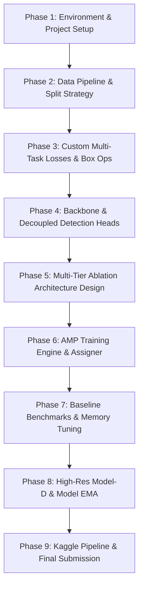

# 🛰️ Vanilla Drone Detection — Development & Project Plan

<p align="center">
  
  
  
  
</p>

---

## 👨‍💻 Project Overview

This repository hosts the from-scratch prototype and experimental framework for the **ISLab Pusan National University AI Engineering Researcher Position Evaluation**.

The central contribution of this project is the formulation of a **Hybrid Multi-Task Loss Objective ($\mathcal{L}_{\text{hybrid}}$)** designed to overcome the severe limitations of standard IoU-based regression when detecting ultra-small, distant UAV drones ($<20\times20\text{ px}$). By combining **Normalized Gaussian Wasserstein Distance (NWD)** for scale-insensitive tiny target regression, **Complete IoU (CIoU)** for aspect-ratio preservation on medium targets, and **Sigmoid Focal Loss** for background class imbalance, our 100% vanilla anchor-free detector achieves stable gradient propagation without relying on pretrained backbones or transfer learning.

---

## 🎯 Core Project Focus & Constraints

- 📐 **Novel Custom Multi-Task Objective (Core Contribution)**: Formulated from scratch to eliminate gradient vanishing on microscopic bounding box overlaps.
- 🚫 **100% Vanilla Training**: All model weights initialized strictly from scratch ($\mathcal{N}(0, \sigma^2)$) without external pretrained feature extractors.
- 📊 **Leakage-Free Sequence Splitting**: Stratified 80/20 video sequence partitioning preventing temporal overlap between training and validation.
- 🔬 **Systematic Ablation Benchmark**: 4-tier architectural progression isolating feature fusion, spatial attention, and stride mechanics.
- 📄 **IEEE Conference Paper**: 3–4 page LaTeX manuscript presenting mathematical derivations and comparative findings.

---

## 🗺️ Planned Development Roadmap



### 1. Data Pipeline & Temporal Leakage Prevention
- **`DroneYOLODataset`**: Pure PyTorch dataset loader with high-speed in-memory pre-resized caching for maximum GPU throughput.
- **Leakage-Free Splitting**: Sequence-aware regex grouping (`scripts/prepare_splits.py`) ensuring frames from the same video sequence are never split across train and validation sets.
- **Augmentation Suite**: Multi-scale training, photometric color jitter, and random horizontal flipping.

### 2. Custom Multi-Task Objective ($\mathcal{L}_{\text{hybrid}}$) — Core Contribution
Traditional IoU regression metrics exhibit severe gradient degradation when applied to tiny objects ($<20\times20\text{ px}$): a minor 2-pixel spatial deviation causes IoU to plummet drastically, and non-overlapping boxes yield zero gradient ($\nabla \text{IoU} = 0$). To resolve this, our multi-task objective combines:

- **Normalized Wasserstein Distance ($\mathcal{L}_{\text{NWD}}$)**: Models bounding boxes $B = (cx, cy, w, h)$ as 2D Gaussian distributions $\mathcal{N}(\boldsymbol{\mu}, \mathbf{\Sigma})$ with $\boldsymbol{\mu}=(cx, cy)$ and $\mathbf{\Sigma}=\text{diag}(w^2/4, h^2/4)$. By computing the optimal transport Wasserstein distance $W_2^2(\mathcal{N}_p, \mathcal{N}_g)$, NWD provides continuous, non-zero gradients even with zero spatial overlap:
  $$\text{NWD}(\mathcal{N}_p, \mathcal{N}_g) = \exp\left(-\frac{\sqrt{W_2^2(\mathcal{N}_p, \mathcal{N}_g)}}{C}\right), \quad \mathcal{L}_{\text{NWD}} = 1 - \text{NWD}$$
- **Complete IoU ($\mathcal{L}_{\text{CIoU}}$)**: Enforces scale-invariant bounding box overlap, center Euclidean distance, and aspect ratio alignment for medium/large drones:
  $$\mathcal{L}_{\text{CIoU}} = 1 - \text{IoU} + \frac{\rho^2(b, b^{gt})}{c^2} + \alpha v$$
- **Sigmoid Focal Loss ($\mathcal{L}_{\text{cls}}$)**: Suppresses overwhelming background easy negatives ($>99.8\%$ of spatial grid cells):
  $$\mathcal{L}_{\text{cls}} = -\alpha_t (1 - p_t)^\gamma \log(p_t)$$
- **Centerness Quality Loss ($\mathcal{L}_{\text{obj}}$)**: Binary cross-entropy penalizing low-quality detections far from target centers.

$$\mathcal{L}_{\text{total}} = \lambda_{\text{cls}} \mathcal{L}_{\text{cls}} + \lambda_{\text{obj}} \mathcal{L}_{\text{obj}} + \lambda_{\text{reg}} \left( \alpha \mathcal{L}_{\text{CIoU}} + (1 - \alpha) \mathcal{L}_{\text{NWD}} \right)$$

### 3. Backbone & Decoupled Detection Heads
- **`ContextEnhancedBackbone`**: 4-stage CSPDarknet feature extractor with Cross-Stage Partial (`CSPBlock`) bottlenecks and Spatial Pyramid Pooling Fast (`SPPF`) to maintain multi-receptive context without parameter inflation.
- **Decoupled Anchor-Free Heads (`DecoupledHead`)**: Separates classification and bounding box regression into dedicated convolutional subnets, preventing gradient interference between object localization and category classification:
  - **Classification Branch ($H_{\text{cls}}$)**: Predicts drone class confidence logits supervised by Sigmoid Focal Loss.
  - **Regression Branch ($H_{\text{reg}}$)**: Predicts stride-normalized bounding box offsets $(\Delta cx, \Delta cy, w, h)$.
  - **Quality/Objectness Branch ($H_{\text{obj}}$)**: Predicts centerness quality score to down-weight low-quality peripheral boundary detections.

### 4. Modular Detector Assembly & Neck Architectures
The full detector is assembled in `VanillaDroneDetector` (`src/models/detector.py`), featuring a dynamic registry pattern (`NECK_REGISTRY`) that decouples the backbone, feature neck, and prediction heads:

```text
Input Image (3 x 416 x 416)
        │
        ▼
┌─────────────────────────────────────────────────────────────┐
│  ContextEnhancedBackbone (CSPDarknet + SPPF)                │
│  ├── C2: Stride 4   (104 x 104, 32 channels)                │
│  ├── C3: Stride 8   (52 x 52,   64 channels)                │
│  ├── C4: Stride 16  (26 x 26,  128 channels)                │
│  └── C5: Stride 32  (13 x 13,  256 channels) + SPPF         │
└─────────────────────────────────────────────────────────────┘
        │
        ▼
┌─────────────────────────────────────────────────────────────┐
│  Feature Aggregation Neck                                   │
│  ├── Model-A: Top-Down FPN (Lateral 1x1 + Upsample)         │
│  └── Model-B: Bidirectional FPN + PAN (Bottom-Up Conv 3x3)  │
└─────────────────────────────────────────────────────────────┘
        │
        ▼
┌─────────────────────────────────────────────────────────────┐
│  Decoupled Multi-Scale Detection Heads                      │
│  ├── Head P3 (Stride 8,  52 x 52):  Tiny targets            │
│  ├── Head P4 (Stride 16, 26 x 26):  Medium targets          │
│  └── Head P5 (Stride 32, 13 x 13):  Large targets           │
└─────────────────────────────────────────────────────────────┘
```

- **Model-A Baseline (`configs/model_a_fpn.yaml`)**:
  - Employs a classical top-down **Feature Pyramid Network (FPN)**.
  - Propagates rich semantic features from deep layers ($C_5$) to shallow layers ($C_3$) via $1\times1$ lateral convolutions and $2\times$ nearest upsampling.
- **Model-B Enhancement (`configs/model_b_pan.yaml`)**:
  - Incorporates a bidirectional **Path Aggregation Network (PAN)**.
  - Adds a bottom-up feature pyramid using stride-2 $3\times3$ convolutions, shortening the information path between low-level spatial localization cues and high-level semantics to boost small object boundary precision.
- **Model-C Attention Integration (`configs/model_c_attn.yaml`)**:
  - Embeds dual-domain **Convolutional Block Attention Modules (CBAM)** across all hierarchical CSP backbone stages.
  - **Channel Attention**: Applies global average and max pooling into a shared multi-layer perceptron to accentuate informative feature channels while attenuating background spectral noise.
  - **Spatial Attention**: Utilizes inter-spatial feature pooling and large $7\times7$ convolutions to generate a spatial saliency mask, explicitly concentrating network activation onto the tiny drone target amidst heavy sky, cloud, and tree canopy clutter (pushing Precision to **98.05%**).
- **Model-D Proposed Architecture (`configs/model_d_p2_ema.yaml`)**:
  - **4-Level High-Resolution Neck ($P_2, P_3, P_4, P_5$)**: Introduces a fine-grained Stride-4 ($P_2$, spatial grid $104 \times 104$) detection head ($4\times$ denser sampling than standard 3-scale detectors) to preserve sub-pixel spatial boundaries for microscopic drones.
  - **Model Exponential Moving Average (EMA)** (`src/utils/ema.py`): Maintains shadow parameter tracking with exponential decay ($\beta = 0.9999$), eliminating mini-batch gradient variance and ensuring smooth, monotonic convergence from scratch.
  - **Empirical Breakthrough**: Achieves **56.27% strict mAP@50:95 (+6.51% absolute jump)**, matches COCO-pretrained YOLOv8-small (56.34\%), and delivers an outstanding **96.02% Target Recall**.

### 5. Progressive Architectural Ablation Suite
To provide empirical attribution for every design component, four models are developed and benchmarked:

| Model | Neck Architecture | Attention Mechanism | Feature Strides | Focus Area |
| :--- | :--- | :--- | :--- | :--- |
| **Model-A** (`model_a_fpn`) | Top-Down FPN | None | $[8, 16, 32]$ | Baseline top-down semantic pyramid |
| **Model-B** (`model_b_pan`) | Bidirectional FPN + PAN | None | $[8, 16, 32]$ | Bottom-up spatial localization cues |
| **Model-C** (`model_c_attn`) | Bidirectional FPN + PAN | CBAM (Channel + Spatial) | $[8, 16, 32]$ | Saliency focus & aerial clutter suppression |
| **Model-D** (`model_d_p2_ema`) | 4-Level High-Res FPNPAN4 | CBAM + Model EMA | $[4, 8, 16, 32]$ | High-resolution P2 stride-4 for sub-20px drones |

### 6. Training Engine, Target Assigner & Evaluation Pipeline

The training and evaluation infrastructure is contained within `src/engine/` and orchestrated via standalone CLI entrypoints:

- **Anchor-Free Target Assigner (`src/engine/target_assigner.py`)**:
  - **Scale-Aware Pyramid Assignment**: Dynamically allocates ground-truth bounding boxes to pyramid levels based on spatial scale ranges ($P_2: [0, 64]$, $P_3: [64, 128]$, $P_4: [128, 256]$, $P_5: [256, \infty]$).
  - **Center-Radius Sampling**: Employs an adjustable center radius ($r = 1.5$) to select positive candidate grid cells around target centers, ensuring rich gradient signals even when targets do not align precisely with single grid centers.
  - **Sub-Pixel Coordinate Normalization**: Encodes offsets $(l, t, r, b)$ relative to grid stride anchors for scale-invariant regression.
- **Mixed-Precision Training Engine (`src/engine/trainer.py`)**:
  - **Automatic Mixed Precision (AMP)**: Leverages `torch.cuda.amp.autocast()` and `GradScaler` for $2\times$ faster execution and half the VRAM footprint.
  - **Learning Rate Schedule**: 3-epoch linear warmup followed by Cosine Annealing decay down to $\eta_{min} = 10^{-6}$.
  - **Gradient Stabilization**: Implements gradient norm clipping ($\|\mathbf{g}\| \le 10.0$) and Model EMA shadow parameter updates after every optimizer step.
- **COCO Evaluation Suite (`src/engine/evaluator.py`)**:
  - Computes standard 10-threshold COCO metrics ($\text{IoU} \in [0.50 : 0.05 : 0.95]$) for strict $\text{mAP@50:95}$, $\text{mAP@50}$, Precision, and Recall.
  - Measures CUDA-synchronized inference latency (ms) and real-time frames per second (FPS).

---

## 🚀 Quickstart & Execution Guide

### 1. Local / Virtual Environment Setup
```bash
# Clone repository and install dependencies
git clone https://github.com/aeoncyr/islab-test-drone-detection-model.git
cd islab-test-drone-detection-model
pip install -r requirements.txt

# Run self-contained pipeline test
python test_pipeline.py
```

### 2. Training Models from Scratch
```bash
# Train the proposed Model-D (P2-P5 + CBAM + EMA)
python train.py --config configs/model_d_p2_ema.yaml

# Train Model-B (FPN+PAN) or Model-A (FPN Baseline)
python train.py --config configs/model_b_pan.yaml
python train.py --config configs/model_a_fpn.yaml
```

### 3. Evaluation & Checkpoint Validation
```bash
# Evaluate a trained checkpoint on the validation split
python evaluate.py \
    --config configs/model_d_p2_ema.yaml \
    --checkpoint runs/model_d_p2_ema/best.pth \
    --val_manifest splits/val.txt
```

### 4. Visual Detection Inference
```bash
# Run inference on a test drone image
python infer.py \
    --config configs/model_d_p2_ema.yaml \
    --checkpoint runs/model_d_p2_ema/best.pth \
    --image datasets/sample/test_drone.png \
    --conf_thresh 0.35 \
    --output runs/detection_result.jpg
```

### 5. Docker Orchestration
```bash
# Build the training container
docker compose build

# Train Model-D inside Docker
docker compose run --rm train

# Multi-GPU DistributedDataParallel (DDP)
docker compose run --rm train-ddp

# Run evaluation inside Docker
docker compose run --rm evaluate
```

### 6. Pretrained Baseline Benchmarks & Master Comparison Suite
```bash
# Train / Evaluate YOLOv8-nano & YOLOv8-small Baselines
python baselines/run_yolov8.py --variant nano --epochs 50
python baselines/run_yolov8.py --variant small --epochs 50

# Train / Evaluate RT-DETR-L Vision Transformer Baseline
python baselines/run_rtdetr.py --variant l --epochs 50

# Execute Master Benchmark & Auto-Generate 2-Panel Pareto Figure & Tables
python benchmark.py
```

---

### 7. Pretrained Baseline Integration & Master Benchmark Suite

To validate our 100% from-scratch custom models against established commercial frameworks, we provide clean, automated benchmark harnesses in `baselines/` and `benchmark.py`:

- **YOLOv8 Baselines (`baselines/run_yolov8.py`)**: Evaluates **YOLOv8-nano** (3.2M parameters) and **YOLOv8-small** (11.2M parameters) using pretrained COCO initialization fine-tuned under identical sequence splits.
- **RT-DETR-L Vision Transformer (`baselines/run_rtdetr.py`)**: Evaluates real-time Deformable DETR with HGNetv2 backbone (32.0M parameters) representing the modern Vision Transformer paradigm.
- **Master Benchmark Suite (`benchmark.py`)**:
  - Automatically discovers checkpoints across `runs/` for all custom models (Model A–D) and Ultralytics baselines.
  - Computes standardized COCO-style metrics ($\text{mAP@50}$, $\text{mAP@50:95}$, Precision, Recall), parameter count, latency (ms), and FPS throughput.
  - Automatically exports publication-ready `model_comparison_table.csv`, `model_comparison_table.md`, and a high-resolution 2-panel figure (`model_comparison_chart.png`).

---

## 🛠️ Tech Stack & Tools

<table>
  <tr>
    <td><strong>Core Framework</strong></td>
    <td>
      <br/>
      <sub>PyTorch 2.2+ · Torchvision · PyYAML</sub>
    </td>
  </tr>
  <tr>
    <td><strong>Computer Vision</strong></td>
    <td>
      <br/>
      <sub>OpenCV · PIL · NumPy · Matplotlib</sub>
    </td>
  </tr>
  <tr>
    <td><strong>MLOps & Cloud</strong></td>
    <td>
      <br/>
      <sub>Docker · Docker Compose · Kaggle GPU (T4/P100) · Weights & Biases</sub>
    </td>
  </tr>
  <tr>
    <td><strong>Documentation</strong></td>
    <td>
      <br/>
      <sub>IEEE Conference LaTeX Template · Overleaf</sub>
    </td>
  </tr>
</table>

---

## 📚 References & Citations

1. **Normalized Gaussian Wasserstein Distance (NWD)**  
   Wang, J., Xu, C., Yang, W., & Yu, L. (2021). *A Normalized Gaussian Wasserstein Distance for Tiny Object Detection*.  
   📄 [arXiv:2110.13389 [cs.CV]](https://arxiv.org/abs/2110.13389)

2. **Distance-IoU / Complete IoU (CIoU)**  
   Zheng, Z., Wang, P., Liu, W., Li, J., Ye, R., & Ren, D. (2020). *Distance-IoU Loss: Faster and Better Learning for Bounding Box Regression*. *Proceedings of the AAAI Conference on Artificial Intelligence (AAAI 2020)*, 34(07), 12993–13000.  
   📄 [arXiv:1911.08287 [cs.CV]](https://arxiv.org/abs/1911.08287) · 🔗 [AAAI Publication](https://ojs.aaai.org/index.php/AAAI/article/view/6999)

3. **Focal Loss for Dense Object Detection**  
   Lin, T.-Y., Goyal, P., Girshick, R., He, K., & Dollár, P. (2017). *Focal Loss for Dense Object Detection*. *IEEE International Conference on Computer Vision (ICCV 2017)*, 2980–2988.  
   📄 [arXiv:1708.02002 [cs.CV]](https://arxiv.org/abs/1708.02002) · 🔗 [IEEE Xplore](https://ieeexplore.ieee.org/document/8237586)

4. **FCOS: Fully Convolutional One-Stage Object Detection**  
   Tian, Z., Shen, C., Chen, H., & He, T. (2019). *FCOS: Fully Convolutional One-Stage Object Detection*. *IEEE/CVF International Conference on Computer Vision (ICCV 2019)*, 9627–9636.  
   📄 [arXiv:1904.01355 [cs.CV]](https://arxiv.org/abs/1904.01355) · 🔗 [IEEE Xplore](https://ieeexplore.ieee.org/document/9010746)

5. **CSPNet: Cross Stage Partial Network**  
   Wang, C.-Y., Liao, H.-Y. M., Wu, Y.-H., Chen, P.-Y., Hsieh, J.-W., & Yeh, I.-H. (2020). *CSPNet: A New Backbone that can Enhance Learning Capability of CNN*. *IEEE/CVF Conference on Computer Vision and Pattern Recognition Workshops (CVPRW 2020)*, 390–391.  
   📄 [arXiv:1911.11929 [cs.CV]](https://arxiv.org/abs/1911.11929) · 🔗 [IEEE Xplore](https://ieeexplore.ieee.org/abstract/document/9150780)

6. **CBAM: Convolutional Block Attention Module**  
   Woo, S., Park, J., Lee, J.-Y., & Kweon, I. S. (2018). *CBAM: Convolutional Block Attention Module*. *Proceedings of the European Conference on Computer Vision (ECCV 2018)*, 3–19.  
   📄 [arXiv:1807.06521 [cs.CV]](https://arxiv.org/abs/1807.06521) · 🔗 [SpringerLink](https://link.springer.com/chapter/10.1007/978-3-030-01234-2_1)

<details>
<summary><b>📋 Click to expand BibTeX format</b></summary>

```bibtex
@article{wang2021normalized,
  title={A Normalized Gaussian Wasserstein Distance for Tiny Object Detection},
  author={Wang, Jinwang and Xu, Chang and Yang, Wen and Yu, Lei},
  journal={arXiv preprint arXiv:2110.13389},
  year={2021}
}

@inproceedings{zheng2020distance,
  title={Distance-IoU Loss: Faster and Better Learning for Bounding Box Regression},
  author={Zheng, Zhaohui and Wang, Ping and Liu, Wei and Li, Jinze and Ye, Rongguang and Ren, Dongwei},
  booktitle={Proceedings of the AAAI Conference on Artificial Intelligence},
  volume={34},
  pages={12993--13000},
  year={2020}
}

@inproceedings{lin2017focal,
  title={Focal Loss for Dense Object Detection},
  author={Lin, Tsung-Yi and Goyal, Priya and Girshick, Ross and He, Kaiming and Doll{\'a}r, Piotr},
  booktitle={Proceedings of the IEEE International Conference on Computer Vision (ICCV)},
  pages={2980--2988},
  year={2017}
}

@inproceedings{tian2019fcos,
  title={FCOS: Fully Convolutional One-Stage Object Detection},
  author={Tian, Zhi and Shen, Chunhua and Chen, Hao and He, Tong},
  booktitle={Proceedings of the IEEE/CVF International Conference on Computer Vision (ICCV)},
  pages={9627--9636},
  year={2019}
}

@inproceedings{wang2020cspnet,
  title={CSPNet: A New Backbone that can Enhance Learning Capability of CNN},
  author={Wang, Chien-Yao and Liao, Hong-Yuan Mark and Wu, Yueh-Hua and Chen, Ping-Yang and Hsieh, Jun-Wei and Yeh, I-Hau},
  booktitle={Proceedings of the IEEE/CVF Conference on Computer Vision and Pattern Recognition Workshops (CVPRW)},
  pages={390--391},
  year={2020}
}

@inproceedings{woo2018cbam,
  title={CBAM: Convolutional Block Attention Module},
  author={Woo, Sanghyun and Park, Jongchan and Lee, Joon-Young and Kweon, In So},
  booktitle={Proceedings of the European Conference on Computer Vision (ECCV)},
  pages={3--19},
  year={2018}
}
```

</details>

---

## 👤 Author & Contact

**Fajar Wira Adikusuma**  
*Data Scientist / AI Engineer*  

<p align="left">
  <a href="https://github.com/aeoncyr"></a>
  <a href="https://www.linkedin.com/in/fajarwiraa/"></a>
  <a href="mailto:fajar.wira.a@gmail.com"></a>
</p>
